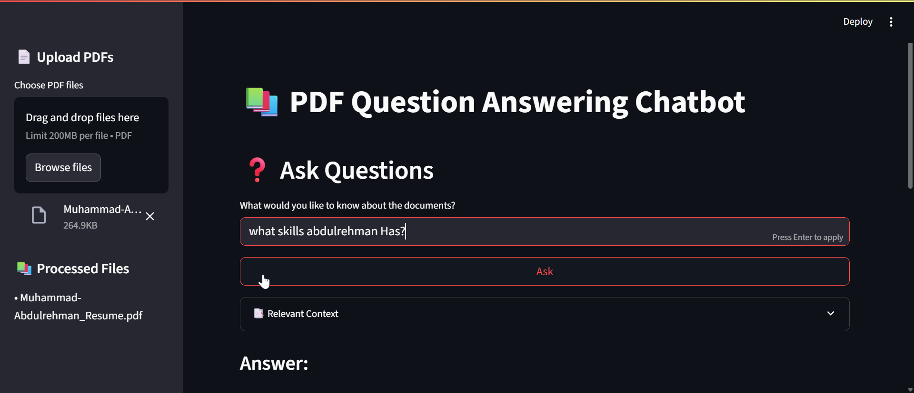

# 📚 PDF Question Answering Chatbot

A RAG AI-powered chatbot that can analyze PDF documents and answer questions based on their content. Built with Streamlit, ChromaDB, and OpenRouter LLM integration.

## 🎥 Demo & Screenshots

<table>
<tr>
  <td width="50%">
    <h3>📽️ Video Demo</h3>
    
    <p align="center"><i>Watch the chatbot in action</i></p>
  </td>
  <td width="50%">
    <h3>🖼️ Interface Screenshot</h3>
    
    <p align="center"><i>Clean and intuitive user interface</i></p>
  </td>
</tr>
</table>

---

## ✨ Features

- 📄 **PDF Processing**: Upload and process multiple PDF documents simultaneously
- 🔍 **Smart Search**: Uses ChromaDB for efficient semantic search and document retrieval
- 🤖 **AI-Powered Responses**: Leverages OpenRouter LLM for intelligent question answering
- 📊 **Interactive UI**: Clean and responsive Streamlit interface with theme support
- 📑 **Context Awareness**: Shows relevant document sections for transparency
- 🎨 **Theme-Aware Design**: Adapts to light/dark mode with consistent styling

## 🚀 Getting Started

### Prerequisites

- Python 3.8 or higher
- Virtual environment (recommended)

### Installation

1. Clone the repository:
```bash
git clone https://github.com/AbdulRehman028/RAG-ChatBot.git
cd QA-CHAT_BOT
```

2. Create and activate a virtual environment:
```bash
python -m venv .venv
# On Windows
.venv\Scripts\activate
# On macOS/Linux
source .venv/bin/activate
```

3. Install dependencies:
```bash
pip install -r requirements.txt
```

4. Set up environment variables:
   - Create a `.env` file in the project root
   - Add your OpenRouter API key:
```
OPENROUTER_API_KEY=your_api_key_here
```
 You can add your api key of open router or any other kay available to you 

 anthropic api key here = https://console.anthropic.com/login?selectAccount=true&returnTo=%2Fsettings%2Fkeys%3F


### Running the Application

1. Start the Streamlit app:
```bash
streamlit run pdf_qa_chatbot.py
```

2. Open your browser and navigate to `http://localhost:8501`

## 🎯 How to Use

1. **Upload Documents**
   - Click the "Choose PDF files" button in the sidebar
   - Select one or more PDF files
   - Wait for processing to complete (indicated by ✅)

2. **Ask Questions**
   - Type your question in the input field
   - Click "Ask" or press Enter
   - View the answer and supporting references

3. **View Context**
   - Expand the "Relevant Context" section to see source documents
   - References show exact document names and page numbers

## 🔧 Technical Features

### Document Processing
- **Chunking**: Documents are split into manageable chunks with metadata
- **Embedding**: Uses SentenceTransformers for high-quality text embeddings
- **Vector Storage**: ChromaDB for efficient similarity search
- **Context Window**: Optimized chunk size and overlap for better context preservation

### Answer Generation
- **Context Retrieval**: Smart selection of relevant document sections
- **AI Processing**: Uses meta-llama/llama-3-8b-instruct model via OpenRouter
- **Structured Output**: Clearly separated answer and reference sections

### User Interface
- **Responsive Design**: Adapts to different screen sizes
- **Theme Support**: Compatible with Streamlit's theme system
- **Progress Indicators**: Clear feedback during document processing
- **Error Handling**: Graceful error management and user feedback

## 💡 Tips for Best Results

- Upload clear, text-based PDFs for optimal processing
- Ask specific questions for more precise answers
- Check the references section for source verification
- Use the context expander to validate answers
- Process related documents together for comprehensive answers

## 🛠 Dependencies

- `streamlit`: Web interface
- `chromadb`: Vector database
- `sentence-transformers`: Text embedding
- `pypdf`: PDF processing
- `python-dotenv`: Environment management
- `requests`: API communication

## 📝 Notes

- The application maintains a session state for processed files
- ChromaDB collections are refreshed on each run for consistency
- The LLM model can be configured via environment variables
- Document chunks are optimized for context preservation

<br>

                                        Developed By M.Abdulrehman❤️
